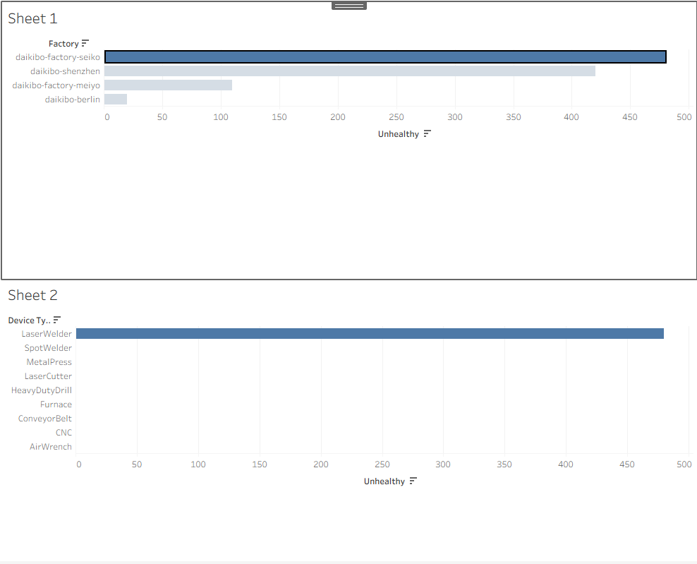

# 📊 Deloitte Data Analytics Virtual Experience

## 🚀 Project Overview

This project showcases my work from the Deloitte Data Analytics Virtual Experience on Forage, where I applied data analysis and visualization techniques to real-world datasets.

---

## 📁 Tasks Completed

### 🔹 Task 1: Data Visualization (Tableau)

* Analyzed factory telemetry data
* Built an interactive dashboard
* Compared unhealthy device counts across factories and device types

### 🔹 Task 2: Data Analysis (Excel)

* Processed equality score dataset
* Created classification:

  * Fair
  * Unfair
  * Highly Discriminative
* Identified inequality patterns across roles

---

## 🛠 Tools Used

* Tableau
* Microsoft Excel
* Data Analysis
* Data Visualization

---

## 📊 Dashboard Preview

---

## 📂 Project Structure

* `excel/` → Data analysis
* `dashboard/` → Visualization

---

## 🎯 Key Learnings

* Real-world data analysis workflow
* Dashboard creation
* Business insight generation

---

## 🔗 Certificate

Completed via Deloitte Data Analytics Virtual Experience (Forage)

---
